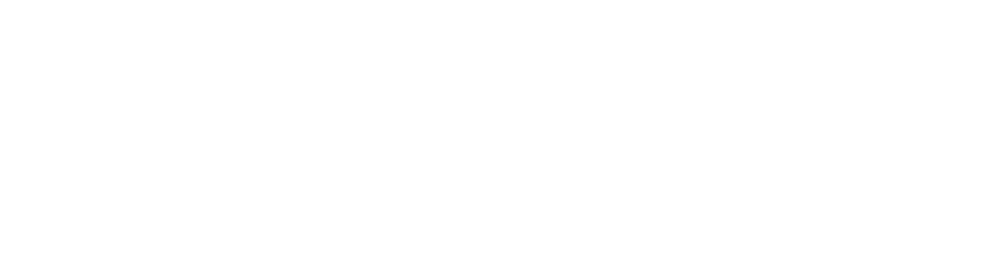

---

* **Current Goal:** Learning backend logic by coding my own modular Item system.
* **Next Up:** Studying engine architecture, math patterns, and structural planning.
* **The Big Goal (Early / Mid 2027):** Building a custom game engine from scratch to see how it all connects.

---
<!-- Skillsets -->

**Languages:** Java (*Primary*), Rust (*Learning*)
 
**Tools & IDEs:** JetBrains IDEs (*Primary*), GitHub, Figma, Godot (*Learning*)
 
**Environment:** Windows 11

---

[//]: # (<!-- Featured Projects -->)

[//]: # ()

[//]: # ()
[//]: # (<table width="100%">)

[//]: # (    <tr>)

[//]: # (        <td width="50%" valign="top">)

[//]: # (            
)

[//]: # (               )

[//]: # (            
)

[//]: # (            <b>Project Name</b> )

[//]: # (             )

[//]: # (            
Lorem ispum dolor sit amet, consectetur adipiscing elit.
)

[//]: # (            <a href="REPO_LINK_HERE">View Code →</a>)

[//]: # (        </td>)

[//]: # (        <!-- Start of new Card -->)

[//]: # (    </tr>)

[//]: # (</table>)

[//]: # (---)

<!-- Projects -->

- **Number Guessing Game** - A Simple Worldle inspired number guessing game coded in Rust!
   
  <a href="https://github.com/xSilzy/GuessingGame">View Code →</a>

- **CLI Combination Calculator** - A simple command-line tool to calculate combinations (using the nCr formula) that i made for practice. Built in Java.
   
  <a href="https://github.com/xSilzy/CLI-Combination-Calculator">View Code →</a>

- **RPG Style Character Config** - A little project I made to get more familiar with Java and its different features (Classes/ Subclasses, Enums, Interfaces etc.).
   
  <a href="https://github.com/xSilzy/rpg-style-character-config">View Code →</a>

- **Ping Pong** - My first ever attempt at making a video game!
   
  <a href="https://github.com/xSilzy/PingPong">View Code →</a>

---

<!-- Footer -->

    
Contact Me

    <a href="https://x.com/xSilzy">[Twitter/X | @xSilzy]</a>
    &nbsp&nbsp•&nbsp&nbsp;
    <a href="https://discord.com">[Discord | @Silzy]</a>

 

  

